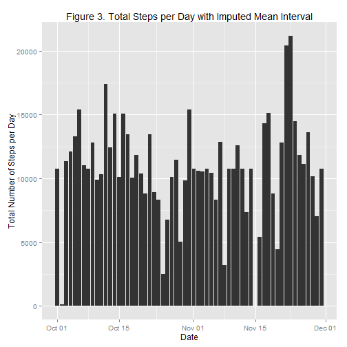

# Reproducible Research: Peer Assessment 1
Jeff Stephens

## Loading and preprocessing the data
First, we will load the libraries used to process and display the data.


```r
library(reshape)
library(ggplot2)
```

This section of code reads in the comma separated file (activity.csv) in the main directory and converts the dates into a format suitable for date/time calculations in R. The data is stored in a data frame, activity.data.


```r
activity.data <- read.table(file="activity/activity.csv",
                            header=TRUE,
                            sep=",",
                            stringsAsFactors=FALSE)
activity.data$date <- as.Date(activity.data$date,"%Y-%m-%d")
```

## What is mean total number of steps taken per day?
This code will summarize the information in activity.data into a daily summary (activity.daily.sum). Eliminating NA values, it will prepare the data for plotting in R.

```r
activity.melt <- melt (activity.data,id=c("interval","date"),measured="steps",na.rm=TRUE)
activity.daily.sum <- cast (activity.melt,date~variable,fun=sum)
ggplot(data=activity.daily.sum, aes(x=date, y=steps)) + 
        geom_bar(stat="identity") +
        xlab("Date")+
        ylab("Total Number of Steps per Day")+
        ggtitle("Figure 1. Total Number of Steps per Day")
```

 
  
The mean total steps per day over the entire period are 1.0766 &times; 10<sup>4</sup> while the median steps per day over the entire period are 10765.

The code for the above calcutions are printed here to enable the code to be reviewed:

```r
mean(activity.daily.sum$steps)
```

```
## [1] 10766
```

```r
median(activity.daily.sum$steps)
```

```
## [1] 10765
```

## What is the average daily activity pattern?
The data is recast slicing it by 5-minute interval instead of day and placed into activity.interval.mean. The time series plot of this data for each 5-minute interval over all days is plotted below:

```r
activity.interval.mean <- cast (activity.melt,interval~variable,fun=mean)
ggplot(data=activity.interval.mean, aes(x=interval, y=steps)) + 
        geom_line(aes(group=1)) +
        xlab("Five Minute Interval")+
        ylab("Mean Number of Steps")+
        ggtitle("Figure 2. Mean Number of Steps for Each Interval Over All Days")
```

 
  
The maxium number of steps are 206.1698 at interval 835.

The code for the above calcutions are printed here to enable the code to be reviewed:

```r
activity.interval.mean[which.max(activity.interval.mean$steps),2]
```

```
## [1] 206.2
```

```r
activity.interval.mean[which.max(activity.interval.mean$steps),1]
```

```
## [1] 835
```

## Imputing missing values

The 2304 missing values in the original data set (activity.data) were replaced by the mean for that interval over all other time periods. 

The code for the above calcutions are printed here to enable the code to be reviewed:

```r
sum(is.na(activity.data))
```

```
## [1] 2304
```

First, a logical vector is created identifying those values that are missing (NA). A new imputed data set, activity.clean, is initialized with the original data frame, and merged with a temporary (temp) data frame that was assembled using the activity.mean.interval data. A final plot is attached.


```r
activity.clean <- activity.data
missing.data <- is.na(activity.data)
temp <- merge(activity.data[missing.data,],activity.interval.mean,by="interval")
activity.clean[missing.data,1]<-temp[order(temp$date,temp$interval),4]
activity.clean.melt <- melt (activity.clean,id=c("interval","date"),measured="steps",na.rm=TRUE)
activity.clean.sum <- cast (activity.clean.melt,date~variable,fun=sum)
ggplot(data=activity.clean.sum, aes(x=date, y=steps)) + 
        geom_bar(stat="identity") +
        xlab("Date")+
        ylab("Total Number of Steps per Day")+
        ggtitle("Figure 3. Total Steps per Day with Imputed Mean Interval")
```

 
  
The mean total steps per day over the entire period using the mean value for that interval to replace NA values are 1.0766 &times; 10<sup>4</sup> while the median steps per day over the entire period are 1.0766 &times; 10<sup>4</sup>.

Using imputed values in this way leads to a difference of 0 for mean value and 
1.1887 for the median values. This leads to the conclusion that imputing the data in this way has little effect on the estimates for total daily number of steps.

The code for the above measurements are printed here to enable the code to be reviewed:

```r
mean(activity.clean.sum$steps)
```

```
## [1] 10766
```

```r
median(activity.clean.sum$steps)
```

```
## [1] 10766
```

```r
mean(activity.clean.sum$steps)-mean(activity.daily.sum$steps)
```

```
## [1] 0
```

```r
median(activity.clean.sum$steps)-median(activity.daily.sum$steps)
```

```
## [1] 1.189
```

## Are there differences in activity patterns between weekdays and weekends?
A new column was created using the weekdays function to add the name of the day of the week to the data set with imputed values for NA. A second data frame (daysofweek) was created to providing the lookup table necessary to recast the data from days of the week to a factor variable indicating whether it was the weekday or weekend. The recasting was done with a merge and placed into activity.clean.coded. The merge caused the data to be resorted and unsuitable for plotting, so it was reordered by interval.

```r
activity.clean$weekday <- weekdays(activity.clean$date)
weekday <- c("Monday","Tuesday","Wednesday","Thursday","Friday","Saturday","Sunday")
status <- c("weekday","weekday","weekday","weekday","weekday","weekend","weekend")
daysofweek <- data.frame(weekday,status)
activity.clean.coded <- merge(activity.clean,daysofweek,by="weekday")
activity.clean.coded <- activity.clean.coded[order(activity.clean.coded$date,activity.clean.coded$interval),]
```
The panel plot showing the difference between weekend and weekday steps is listed below averaged over all days - weekdays for the top plot and weekends for the bottom plot.

```r
activity.coded.melt <- melt (activity.clean.coded,
                             id=c("interval","date","status","weekday"),
                             measured="steps",
                             na.rm=TRUE)
activity.coded.mean <- cast (activity.coded.melt,
                             interval + status ~ variable,
                             fun=mean)
activity.coded.mean <- activity.coded.mean[order(activity.coded.mean$interval),]
ggplot(data=activity.coded.mean, aes(x=interval, y=steps)) + 
        geom_line(aes(group=1)) +
        facet_grid(status ~ .) +
        xlab("Five Minute Interval")+
        ylab("Mean Number of Steps")+
        ggtitle("Figure 4. Mean Number of Steps for Each Interval Split by Weekday")
```

 
